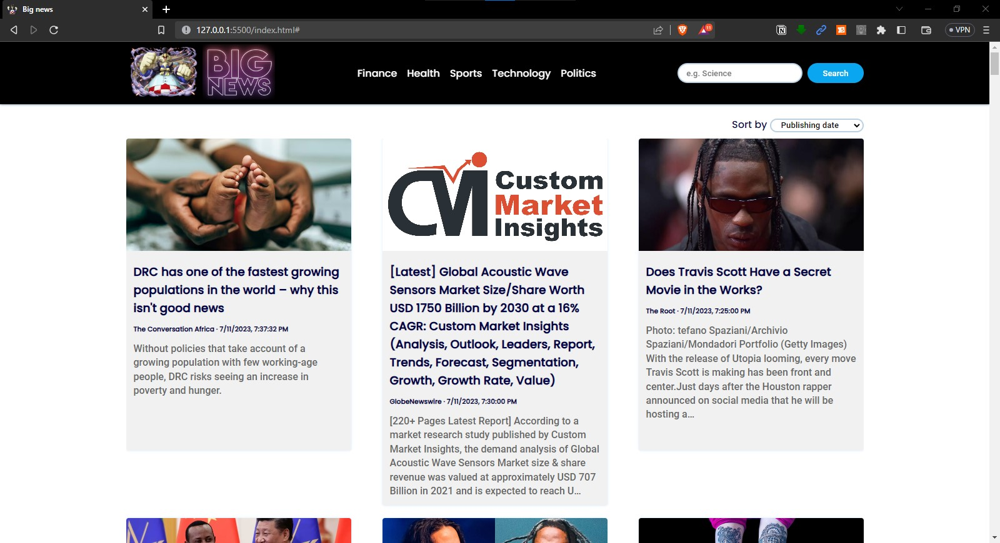

<h1 align="center" id="title">Big News - Your Ultimate News Destination📰</h1>
<div align="center">
  
</div>

<p style="font-size: 16px;">Welcome to Big News, your ultimate destination for the latest news from around the world🌍. Stay informed and up-to-date with our sleek and user-friendly news website😎. Explore a wide range of news categories, dive into captivating articles, and discover the stories that matter most to you🤩.</p>
<hr>

<h2>🎥 Project interface & Video </h2>



<h3>

[🎥 Project video](https://drive.google.com/file/d/10_Ne_ZAVoPdgO3dPBD1NOrXixWqNHZ8t/view?usp=sharing)

</h3>
<hr>

<h2>🧐 Key Features</h2>

* **Seamless Navigation**: Effortlessly navigate through an intuitive interface that offers quick access to diverse news categories, ensuring you never miss a beat.

* **Dynamic Search**: Dive deep into the news ocean with our powerful search feature, allowing you to find articles on specific topics, events, or keywords that pique your interest.

* **Sorting Options**: Customize your news feed based on your preferences. Sort articles by publishing date to stay on top of the latest developments, relevance to get tailored content, or popularity to discover trending stories.

* **Stunning Visuals**: Immerse yourself in the world of news with our visually stunning and captivating news card design. Each card presents a captivating image, attention-grabbing headline, and concise summary to keep you engaged.

* **Read More**: Delve deeper into the articles that catch your attention. With a simple click, access the full article on the source website for a comprehensive read.

* **Powered by the News API**: Big News integrates seamlessly with the powerful News API, ensuring a vast and constantly updated news database at your fingertips.
<hr>

<h2>🛠️ Getting Started</h2>

1. Clone the Big News repository to your local machine.

```bash
git clone https://github.com/Medo072/Big_news_morgans.git
```
2. Configure your API key for the [News API](https://newsapi.org/) to unlock the full potential of Big News.

3. Launch the local development server and watch the magic unfold.  
    **NOTE**: you can simply open the html file and the website will launch or you can use VScode with a live server extension

4. Open your favorite web browser and access Big News to dive into a world of captivating news.
<hr>

<h2>💻 Technologies Used</h2>

 HTML  

 CSS   

 JavaScript   

News API
<hr>


